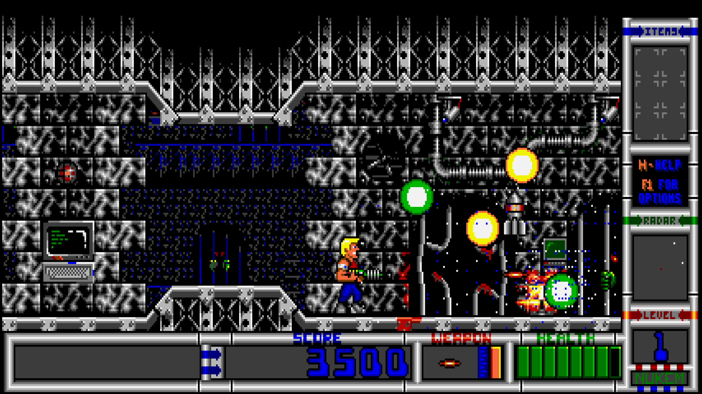

## Welcome to Rigel Engine

RigelEngine is a re-implementation of the game [Duke Nukem II](https://en.wikipedia.org/wiki/Duke_Nukem_II), originally released by Apogee Software in 1993 for MS-DOS.
RigelEngine works as a drop-in replacement for the original executable: It reads the game's data files and plays just like the original,
but runs natively on modern operating systems and is written in modern C++ code with a completely new architecture under the hood.
On top of that, it offers many modern enhancements, including:

* wide-screen mode
* smooth scrolling & movement mode with increased frame rate
* quick saving
* improved game controller support
* extended modding features

There was never any source code released for the original game, so this project
is based on reverse engineering. Disassembly from the original executable served as basis for writing new code from scratch, while video captures from DosBox were used for frame-by-frame verification.
See [my blog post](https://lethalguitar.wordpress.com/2019/05/28/re-implementing-an-old-dos-game-in-c-17/) to learn more about the process.

Try the [web version](https://rigelengine.nikolai-wuttke.de)! (compiled to wasm via Emscripten)

[Download RigelEngine](https://github.com/lethal-guitar/RigelEngine/releases) for Windows, Mac OS, or Linux (deb package).

[Install via Flathub](https://flathub.org/apps/details/io.github.lethal_guitar.RigelEngine)

## Running RigelEngine

In order to run RigelEngine, the game data from the original game is required. Both the shareware version and the registered version work.
When launching RigelEngine for the first time, it will show a file browser UI and ask you to select the location of your Duke Nukem II installation.
The chosen path will be stored in the game's user profile, so that you don't have to select it again next time.

### Acquiring the game data

You can download the shareware version for free from [archive.org](https://archive.org/download/msdos_DUKE2_shareware/DUKE2.zip).
The full version (aka registered version) can be bought on [Zoom Platform](https://www.zoom-platform.com/product/duke-nukem-2).

If you already have a copy of the game, you can also point RigelEngine to that existing installation.
This includes the Steam and Gog versions.

The only files actually required for RigelEngine are:

* `NUKEM2.CMP` (the main data file)
* `NUKEM2.F1`, `.F2`, `.F3` etc. up to `.F5` (intro movie files)

The intro movies aren't mandatory, RigelEngine simply skips movie playback if the files aren't found.
They are still part of the experience though, so I do recommend including them when copying the game files somewhere.

If there are existing saved games, high score lists, or settings found in the game files,
RigelEngine imports them into its own user profile when running for the first time.

### System requirements

RigelEngine is not very demanding, but it does require OpenGL-capable graphics hardware.

Any Nvidia or AMD graphics card from 2007 or later should run the game without problems.
Intel integrated GPUs only added OpenGL 3 support in 2011, however.
On Linux, using GL ES can be an option for those older Intel GPUs.

See [Supported Graphics cards](https://github.com/lethal-guitar/RigelEngine/wiki/Supported-graphics-cards-(GPUs)) for more info.

Aside from the graphics card, you don't need much.
The game needs less than 64 MB of RAM,
and runs fine on a single-core ARMv6 CPU clocked at 700 MHz (Raspberry Pi 1).

## More info and support

You can find more information here:

* [F.A.Q.](https://github.com/lethal-guitar/RigelEngine/wiki/FAQ)
* [README](https://github.com/lethal-guitar/RigelEngine)
* [Wiki](https://github.com/lethal-guitar/RigelEngine/wiki)

If you encounter problems with RigelEngine, feel free to [open an issue](https://github.com/lethal-guitar/RigelEngine/issues/new/choose) or ask on [Discord](https://discord.gg/QKYB6u4Kew).
